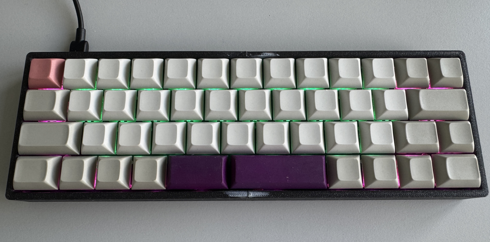

# Atom47 Vial Firmware

Custom Vial enabled firmware for the Atom47 keyboard based on vial-qmk.

## Features

- Vial support
- VIA compatibility
- RGB Matrix support using IS31FL3733
- Split space layout
- QMK DFU bootloader support
- GitHub Actions based cloud builds
- Dynamic keymaps
- Macro support
- Caps Lock RGB indicator

## Layout

The firmware currently supports the LAYOUT_split_space layout with:

- 47 keys
- Split spacebar
- ANSI style layout
- 4 row matrix
- 13 column matrix

## RGB

RGB Matrix is enabled using the IS31FL3733 driver.

Enabled:
- Per key RGB
- Caps Lock indicator LED

Disabled:
- RGBLIGHT
- Underglow

## Build System

The firmware is built automatically using GitHub Actions.

Workflow:
- Checkout this repository
- Checkout vial-qmk
- Copy keyboard files into vial-qmk/keyboards/atom47
- Compile firmware
- Upload artifacts

Generated firmware files:
- .hex
- .bin
- .uf2 (if supported)

## Flashing

The keyboard uses the QMK DFU bootloader.

Example flashing command:

bash dfu-programmer atmega32u4 erase dfu-programmer atmega32u4 flash atom47_vial.hex dfu-programmer atmega32u4 reset 

## Vial

The keyboard is fully configurable through Vial.

Features available in Vial:
- Layer editing
- Macros
- Key remapping
- RGB controls

## Notes

This repository was simplified from the original revision based structure into a flat keyboard structure:

text atom47/ 

The previous rev5 structure is no longer required.

RGB driver initialization and LED mappings were moved into:

text atom47.c

## Build

Local build:

bash qmk compile -kb atom47 -km vial 

## Credits

- QMK Firmware
- Vial
- Atom47 keyboard creators